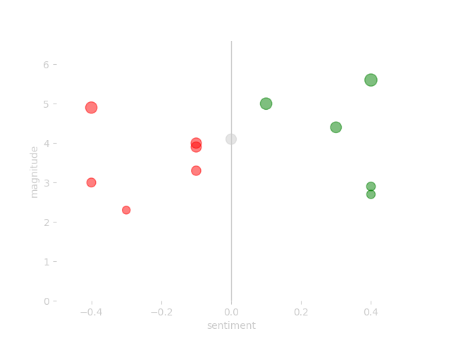
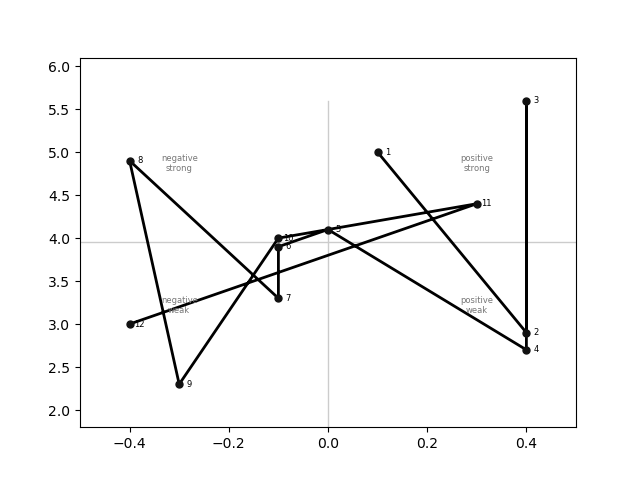

# The Avicii project: a visualisation of the emotion of music lyrics in Python

You can use this project to visualise sentiment data of music lyrics. [Read the origin story](http://www.sentimentshirt.com/stories/honoring-avicii/) to find out why I created it.

# Create a dataviz of the lyrics your favourite artist

Good to see that you want to visualise the lyrics of one of your favourite artists (or just want to know more about this repository). The process is split into two parts:

1. Analyse the song texts.
2. Plot the sentiment data.

I'll use Avicii's posthumous album TIM as an example in this readme. Let's dig in.

# 1. Analyse the songtexts

To run an analysis, you'll need a connection to the Google Cloud Natural Language API. Set up a project in the Google Cloud console and add your `credentials.json` to the project root folder. After that, you'll need a `.txt` file for each song that you want to analyse. Format each song file this way: `songindex-albumname-songtitle.txt`. For the song Peace of Mind by Avicii, the first song on the album TIM, this would be: `1-tip-peace_of_mind.txt`. I store the text files of the albums I generate inside a `songs` folder in my project.

You can copy and paste the lyrics manually, or you can scrape for the lyrics using the `lyrics.py` file. To use the script, you have to make an api key on Genius, and then enter the song titles, artist, and album as appropriate. You will need to create the appropriate folder under the `songs` folder (for example, for Lady Gaga, you will need to create a `Lady_Gaga` folder: `songs/Lady_Gaga`. The script will generate the text files and put them in the folder.

When you have the files ready, you can use `analyse.py` to run the sentiment analysis. From this file, you call `save_array_of_dicts_to_excel()`. The function takes two arguments:

- Array of dicts (the songs and their corresponding sentiment values). Use the `get_song_sentiment('songs/avicii_tim')` function to generate this list. Refer to the correct path location of your songs. In my example, the text files are located in `songs/avicii_tim`.
- Name extension of Excel file. The function will save the file to the `output/` folder. The file name will be `song_sentiment_your_extension.xlsx`.

A full example looks like this:

`save_array_of_dicts_to_excel(get_song_sentiment('songs/avicii_tim'), 'avicii_tim' )`

# 2. Visualise the sentiment data

You can visualise the data with the functions in `visualise.py` . There are two types of visualisations:

- Scatter plot - `scatter_plot_from_dataframe`
- Line plot - `plot_path_from_dataframe`

They both have a unique way of visualising the data. I'll give a basic and advanced example of both. But first, you'll have to transform the generated sheet into a dataframe. You can do so by using the `convert_xlsx_into_dataframe` function:

```
tim_df = convert_xlsx_into_dataframe('output/song_sentiment_avicii_tim.xlsx')
```
_You could also visualise the results of the analysis directly, without saving them into a file. But by doing so, you will call the Google API every time you run the visualisation. By storing the results into a file, you greatly reduce the amount of API calls you have to make._

## The scatterplot of your favourite music

Use the `scatter_plot_from_dataframe` function to create a scatter plot. You only have to pass 2 values: a dataframe, and a magnitude_amplifier:

```
scatter_plot_from_dataframe(
    dataframe=tim_df,
    magnitude_amplifier=28,
)
```
Here's an example of the results:



The function has some optional extra values you can use:

```
scatter_plot_from_dataframe(
    dataframe=tim_df,
    magnitude_amplifier=0,
    album_color='purple',
    annotate='index',
    disable_grid=True,
)
```

Here's another example of the resulting dataviz from this function:


## The line path of your favourite music

This one feels magical to me. Using the paths from Matplotlib, you can draw an organic looking line. It's drawn from one song to the next based on the index on the album.  Use the `path_plot_from_dataframe` function to create the line. You only have to pass a dataframe.

```
plot_path_from_dataframe(
    dataframe=tim_df
)
```

And the result is:


Also this function has some extra options. I've used these during testing. To see if lines were drawn correctly. I decided to keep them in so you can get an understanding of how the drawing works. Here's an example of the function with all it's extra options set:

```
plot_path_from_dataframe(
    dataframe=tim_df,
    show_dots=True,
    disable_grids=False,
    line_type='straight',
)

```
And again the result:



# Story

If you are interested in the why of this repository, read my stories about the origin:

- [The Avicii Project](http://www.edriessen.com/avicii/)
- [Analysing Avicii TIM](http://www.edriessen.com/2019/06/15/visualising-the-emotion-of-aviciis-new-album-tim/)

# To do

The project is currently in a rough state. Things I'll be working on are:

- Store data in csv instead of excel.
